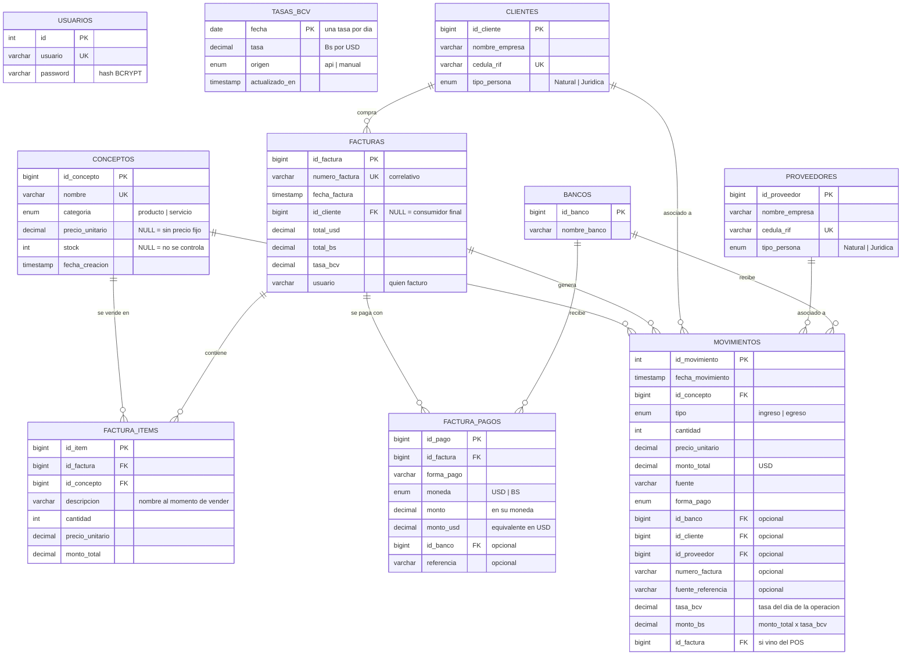

# Base de Datos — Modelo Entidad-Relación
### Sistema de Gestión de Finanzas — `cyber_compunet_db`

## 1. Diagrama Entidad-Relación

> GitHub renderiza este diagrama automáticamente. Para el tomo, puedes
> recrearlo en draw.io / Lucidchart con esta misma estructura.



## 2. Explicación tabla por tabla

| Tabla | ¿Qué guarda? | Detalle importante |
|-------|-------------|--------------------|
| `usuarios` | Cuentas de acceso | Contraseña con hash BCRYPT, nunca en texto plano. |
| `conceptos` | Catálogo de productos y servicios | `categoria` distingue producto (con stock) de servicio (`stock = NULL`). |
| `movimientos` | Cada ingreso o egreso individual | Es el "libro contable". Guarda `tasa_bcv` y `monto_bs` del día de la operación. |
| `facturas` | Cabecera de cada venta del POS | `numero_factura` es ÚNICO (índice UNIQUE) → imposible duplicar correlativos. |
| `factura_items` | Renglones de cada factura | Copia la `descripcion` y el precio del momento (si luego cambia el precio del catálogo, la factura histórica no se altera). |
| `factura_pagos` | Los pagos (posiblemente varios) de una factura | Guarda el monto en su moneda Y su equivalente en USD → auditoría de pagos mixtos. |
| `tasas_bcv` | Una tasa por día | `origen` dice si vino de la API o la fijó el administrador. |
| `clientes` / `proveedores` | Directorios | RIF/cédula con índice UNIQUE (no se duplican). |
| `bancos` | Bancos usados en pagos | Referenciado por movimientos y pagos. |

## 3. Llaves foráneas y reglas de borrado (integridad referencial)

| Relación | Regla | ¿Por qué? |
|----------|-------|-----------|
| movimientos → conceptos | `RESTRICT` | No se puede borrar un producto que tiene historial contable. |
| factura_items → facturas | `CASCADE` | Si se borrara una factura, sus renglones no tienen sentido solos. |
| factura_pagos → facturas | `CASCADE` | Igual que los ítems. |
| movimientos → facturas | `SET NULL` | Si desaparece la factura, el movimiento contable se conserva. |
| movimientos → clientes/proveedores/bancos | `SET NULL` | Borrar un cliente no debe borrar el historial de ventas. |

## 4. ¿Por qué la facturación usa TRANSACCIONES? ⭐

Guardar una factura implica **muchas escrituras**: la cabecera, N ítems,
N pagos, N movimientos y N actualizaciones de stock. Si la luz se va a mitad
de camino, quedaría una factura "a medias" (por ejemplo: con ítems pero sin
pagos, o con stock descontado pero sin factura).

Por eso `guardar_factura.php` envuelve TODO en una transacción SQL:

```php
$pdo->beginTransaction();
// ... insertar factura, items, pagos, movimientos, actualizar stock ...
$pdo->commit();          // solo aquí se hace real
// si algo falla en el camino:
$pdo->rollBack();        // se deshace TODO, como si nada hubiera pasado
```

Esto se llama **atomicidad** (la A de las propiedades **ACID** de las bases
de datos relacionales): la operación ocurre completa o no ocurre.

Además, el correlativo automático se calcula con `SELECT ... FOR UPDATE`
dentro de la transacción, lo que **bloquea** la lectura para que dos cajeros
facturando al mismo tiempo no obtengan el mismo número.

## 5. Decisiones de diseño que puedes defender

1. **USD como moneda base y Bs calculado:** los precios en Venezuela se
   piensan en dólares; el bolívar se deriva con la tasa del día. Guardar ambos
   (con la tasa usada) da trazabilidad contable ante cualquier auditoría.
2. **`stock NULL` vs `stock 0`:** NULL significa "este concepto no maneja
   inventario" (un servicio); 0 significa "es un producto y está agotado".
   Son cosas distintas y el modelo las distingue.
3. **Snapshot en factura_items:** se copia nombre y precio al momento de la
   venta. El catálogo puede cambiar; las facturas emitidas, jamás.
4. **Una tasa por día (PK = fecha):** simple, auditable y suficiente — el BCV
   publica una tasa oficial diaria.
